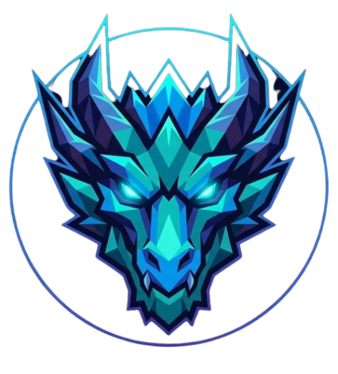

🌐 **Language / Lingua:** 🇬🇧 English · [🇮🇹 Italiano](README.it.md)

# Tech Dragons Events

**The professional platform for esports tournaments**

[🎮 Visit the Platform](https://tech-events-msi.onrender.com) · [Register Free](https://tech-events-msi.onrender.com/register.php) · [Browse Events](https://tech-events-msi.onrender.com/#events) · [News](https://tech-events-msi.onrender.com/news.php)

---

## What is Tech Dragons Events?

Tech Dragons Events is a live esports tournament platform where players and organisations can register teams, enter competitions, and track results across multiple game titles — for free.

**→ [tech-events-msi.onrender.com](https://tech-events-msi.onrender.com)**

---

## For Players & Teams

1. [Create a free account](https://tech-events-msi.onrender.com/register.php) — 30 seconds, no payment required
2. Browse upcoming events and tournaments on the [homepage](https://tech-events-msi.onrender.com/)
3. Register your team for any open tournament
4. Track rosters, brackets, and prize pools

---

## For Event Organizers

Admin accounts can create multi-bracket events, assign game titles, set prize pools, manage team registrations, and post news to the community.

Contact **techdragonevents@gmail.com** to request organizer access.

---

## Platform Features

| Feature | |
|---|---|
| 🏆 **Multi-bracket Tournaments** | Multiple tournaments per event, each with its own game, prize pool, and schedule |
| 👥 **Team & Roster Management** | Register organisations, manage player rosters, assign in-game roles |
| 🔍 **Public Event Pages** | Browse all events, teams, and rosters without an account |
| 📰 **News & Announcements** | Tournament results, upcoming events, platform updates |
| 🔒 **Secure Authentication** | Email verification, Argon2ID hashing, role-based access control |
| 🌍 **EN / IT Bilingual** | Full English and Italian interface with cookie-based switching |
| 📱 **Responsive Design** | Works on desktop, tablet, and mobile |

---

## Supported Games

CS2 · Valorant · Dota 2 · League of Legends · and any title organizers add

---

## Links

| | |
|---|---|
| 🌐 Platform | [tech-events-msi.onrender.com](https://tech-events-msi.onrender.com) |
| 📧 Contact | techdragonevents@gmail.com |
| 📰 News | [/news.php](https://tech-events-msi.onrender.com/news.php) |
| 📜 Privacy Policy | [/privacy.php](https://tech-events-msi.onrender.com/privacy.php) |
| 📋 Terms of Service | [/terms.php](https://tech-events-msi.onrender.com/terms.php) |

---

## Team

| Name | Role |
|---|---|
| [Elisey Rotar](https://github.com/EliseyRotar) | CEO & Founder |
| Aimen Tafihi | Co-Founder & CTO |
| Andrea Valente | Backend Engineer |
| Francesco Daminelli | Frontend Developer |
| Manuel Greco | Operations Manager |

---

## Contributors

---

  © 2026 Tech Dragons Events · <a href="https://tech-events-msi.onrender.com/privacy.php">Privacy</a> · <a href="https://tech-events-msi.onrender.com/terms.php">Terms</a> · Built with PHP & ❤️

