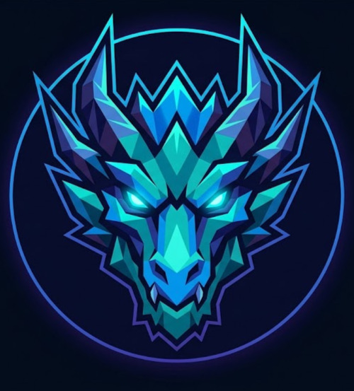

<div align="center">

🌐 **Language / Lingua:** [🇬🇧 English](README.md) · [🇮🇹 Italiano](README.it.md)



# Tech Dragons Events

**The infrastructure for professional esports competition**

[](https://tech-events-msi.onrender.com)
[](https://php.net)
[](https://tidbcloud.com)
[](https://docker.com)
[](#frontend)
[](LICENSE)

**[🌐 tech-events-msi.onrender.com](https://tech-events-msi.onrender.com)**

[Overview](#overview) · [Architecture](#architecture) · [Features](#features) · [Frontend](#frontend) · [Quickstart](#quickstart) · [Security](#security) · [Contributing](#contributing)

</div>

---

## Overview

Tech Dragons Events is a full-stack web application for running professional esports events end-to-end — from event creation and tournament scheduling to team registration and roster management. It pairs a hardened PHP 8.2 / TiDB Cloud backend with a cinematic frontend: a custom WebGL fluid shader, GSAP scroll animations, a scroll-driven 3D particle storytelling section (Three.js), glassmorphism cards, and a complete CSS design system — deployed on Render.com via Docker.

---

## Live Demo

**[https://tech-events-msi.onrender.com](https://tech-events-msi.onrender.com)**

> Hosted on Render.com (free tier) — may take ~30 seconds to wake from idle.  
> Database: TiDB Cloud Serverless (MySQL-compatible, free tier).

---

## Architecture

Only the `public/` directory is exposed to the web server. All application logic, credentials, and templates live outside the web root.

```
tech-events-msi/
├── public/                       # Web root (Apache document root)
│   ├── assets/
│   │   ├── css/
│   │   │   ├── main.css          # Full design system — tokens, components, layout
│   │   │   └── php-pages.css     # Form/admin page overrides
│   │   ├── js/
│   │   │   ├── hero-bg.js        # WebGL fragment shader (domain-warped FBM fluid)
│   │   │   ├── main.js           # GSAP animations, custom cursor, interactions
│   │   │   └── scrollytelling.js # Three.js 4000-particle morphing 3D section
│   │   ├── img/
│   │   │   ├── logo.png          # Logo with transparent background (web)
│   │   │   ├── logo.jpg          # Logo (opaque, used in README / OG)
│   │   │   └── logo.svg          # Vector logo
│   │   └── storici/              # Static game-history HTML archives
│   ├── favicon.ico               # Multi-size favicon (16/32/48)
│   ├── favicon-32.png            # PNG favicon for modern browsers
│   ├── apple-touch-icon.png      # 180×180 touch icon
│   ├── index.php                 # Landing: Hero · Story · Stats · Events · About · Contact
│   ├── dashboard.php             # Authenticated event management portal
│   ├── login.php
│   ├── register.php
│   ├── createEvent.php           # Admin: create events
│   ├── addTournament.php         # Admin: attach tournaments to events
│   ├── addGame.php               # Admin: register game titles
│   ├── addTeam.php               # Register a new organisation
│   ├── addMember.php             # Add players to a roster
│   ├── signTeam.php              # Enter a team into a tournament
│   ├── viewTeam.php              # View registered rosters
│   ├── assignGame.php            # Link a game discipline to a member
│   └── assignRole.php            # Assign a competitive role to a member
├── templates/
│   └── layout/
│       ├── header.php            # <head>, favicon, fonts, GSAP/Three.js CDN, nav, overlay
│       └── footer.php            # Footer columns + main.js include
├── src/
│   ├── Auth.php                  # RBAC — session, login guard, admin guard
│   ├── EnvLoader.php             # Reads .env without leaking values into $_ENV
│   └── helpers.php               # runInTransaction(), t() i18n helper
├── lang/
│   ├── en.php                    # English translation strings
│   └── it.php                    # Italian translation strings
├── database/
│   ├── 01_tables.sql             # Full schema
│   ├── 02_elements.sql           # Seed data
│   └── combined_migration.sql    # Single-file migration for production
├── config.php                    # PDO bootstrap + env loading + TiDB SSL
├── Dockerfile
└── docker-compose.yml
```

---

## Features

### Event Management
- Create LAN and online events with date range, location, and capacity
- Admin-only creation and tournament assignment
- Dashboard with event listing, tournament drill-down, and badge indicators

### Tournament System
- Multiple tournaments per event, each tied to a specific game title
- Prize pool tracking in EUR
- Team registration and per-tournament roster viewing

### Team & Roster Management
- Register organisations with optional sponsor associations
- Add players to rosters using unique in-game nicknames
- Assign game disciplines and competitive roles to individual members

### Internationalisation (i18n)
- Language switcher (Italian / English) in the global nav
- Cookie-based persistence (1-year TTL)
- Add new languages by dropping a file in `lang/`

---

## Frontend

The entire frontend was rebuilt as a dark futuristic design system — no CSS framework, no component library, just hand-crafted CSS custom properties and vanilla JS.

### Design system

| Token | Value |
|---|---|
| `--bg-primary` | `#0a0a0a` |
| `--bg-secondary` | `#111111` |
| `--accent-blue` | `#00d4ff` |
| `--text-primary` | `#ffffff` |
| `--text-secondary` | `#888888` |
| `--border` | `rgba(255,255,255,0.08)` |
| Heading font | Space Grotesk (700) |
| Body font | Inter (400/500/600) |

### WebGL hero background (`hero-bg.js`)

Real-time GPU fluid shader — raw WebGL 1.0:

- **Domain-warped FBM** (Inigo Quilez technique): two layers of fractal Brownian motion that warp each other, producing organic flowing patterns that never repeat
- **Mouse interaction**: the fluid field distorts toward the cursor in real time with exponential smoothing
- **Click shockwave**: clicking fires two concentric expanding rings plus an origin burst, all physically decayed
- Optimised to run at **~60 fps** at 35% of screen resolution

### 3D Scrollytelling section (`scrollytelling.js`)

Scroll-driven immersive experience powered by **Three.js r128** + **GSAP ScrollTrigger**:

- **4 000 additive sprite particles** morph through 5 procedural shapes as you scroll: cloud → Fibonacci globe → tiered arena → tournament bracket → TD emblem
- Per-particle shimmer wobble, ambient camera drift, mouse/touch parallax
- Per-act frosted-glass text panels scrub in/out independently
- Soft glow halo mesh behind the particle field

### Animations (`main.js`)

| Effect | Implementation |
|---|---|
| Page load overlay | Logo fade-out on `window.load` |
| Custom cursor | Dot + lagging ring via `requestAnimationFrame` lerp |
| Hero headline | Word-by-word `translateY` stagger on load |
| Navbar | Transparent → frosted glass on scroll |
| Stats counters | GSAP tween from 0 → target on scroll enter |
| About words | Scrubbed word light-up tied to scroll progress |

---

## Deployment

### Production (Render.com)

The app is automatically deployed to [Render.com](https://render.com) on every push to `main`.

**Required environment variables:**

| Variable | Description |
|---|---|
| `DB_HOST` | TiDB Cloud host |
| `DB_PORT` | `4000` |
| `DB_USER` | TiDB user |
| `DB_PASS` | TiDB password |
| `DB_NAME` | Database name |
| `RESEND_API_KEY` | [Resend](https://resend.com) API key for transactional email |
| `MAIL_FROM` | Sender email address |
| `CONTACT_EMAIL` | Recipient for contact form |
| `MAIL_FROM_NAME` | Sender display name |

### Local (Docker)

**Linux / Arch Linux:**
```bash
./start_arch.sh
```

**Windows 10/11:**
```bat
start_windows.bat
```

Both scripts build the image, start Apache + PHP 8.2 + MariaDB 10.6, and seed the database. Open **http://localhost:8080**.

### Manual setup

**Requirements:** PHP 8.2+, MariaDB 10.6+ (or TiDB Cloud)

```bash
# 1. Clone
git clone https://github.com/EliseyRotar/tech-events-msi.git
cd tech-events-msi

# 2. Configure environment
cp .env.example .env
# edit .env — set DB_HOST, DB_PORT, DB_NAME, DB_USER, DB_PASS

# 3. Import schema + seed data
mariadb -u root -p               < database/01_tables.sql
mariadb -u root -p tech_dragons_events < database/02_elements.sql
# or for production: use database/combined_migration.sql

# 4. Point your web server document root to ./public
```

### Default seeded accounts

| Email | Role | Note |
|---|---|---|
| mario@example.com | Admin | Use register.php to create a fresh account, then set `isAdmin = 1` in DB |
| luigi@example.com | User | Same |

---

## Security

| Concern | Implementation |
|---|---|
| SQL injection | 100% PDO prepared statements — zero string interpolation in any query |
| XSS | `htmlspecialchars($val, ENT_QUOTES, 'UTF-8')` on every `<?=` output |
| Auth bypass | `Auth::requireLogin()` / `Auth::requireAdmin()` at top of every protected page |
| Password storage | `password_hash(..., PASSWORD_ARGON2ID)` |
| Transaction safety | `runInTransaction()` wraps every write; catches `\Throwable` and rolls back |
| Open redirect | `?lang=` handler validates URL starts with `/` and not `//` |
| Credential exposure | `.env` is gitignored; `EnvLoader` reads it without leaking into `$_ENV` |
| Web root isolation | `src/`, `templates/`, `lang/`, `database/` are all outside `public/` |
| TiDB SSL | PDO connects with CA cert; `SSL_VERIFY_SERVER_CERT=false` for serverless |

---

## Tech Stack

| Layer | Technology |
|---|---|
| Language | PHP 8.2 |
| Database | TiDB Cloud Serverless (MySQL-compatible) |
| Web server | Apache 2.4 (Docker) |
| Hosting | Render.com (free tier, auto-deploy) |
| Containerisation | Docker |
| 3D / WebGL | Three.js r128 (particle morph) + raw WebGL 1.0 (fluid shader) |
| Animations | GSAP 3.12 + ScrollTrigger |
| CSS | Custom design system — CSS custom properties, no framework |
| Typography | Space Grotesk + Inter (Google Fonts) |
| Auth | Custom RBAC (`src/Auth.php`) |
| i18n | Cookie-based, file-per-locale (`lang/*.php`) |
| Email | Resend HTTP API |

---

## Contributing

1. Fork and create a feature branch off `main`
2. Backend: PDO prepared statements, `htmlspecialchars()` on all output, wrap writes in `runInTransaction()`
3. Frontend: no frameworks — extend `main.css` tokens, animate via GSAP
4. Open a pull request against `main` — Render auto-deploys on merge

---

## Contributors

<div align="center">

| | Contributor | GitHub | Commits |
|---|---|---|---|
|  | Elisey Rotar | [@EliseyRotar](https://github.com/EliseyRotar) | project lead |
|  | DaminelliF | [@DaminelliF](https://github.com/DaminelliF) | 14 commits |
|  | Manuel Greco | [@manuel-greco-s](https://github.com/manuel-greco-s) | 6 commits |
|  | Andrea Valente | [@Andrea-Valente08](https://github.com/Andrea-Valente08) | 1 commit |

</div>
