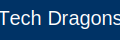

<div align="center">



# Tech Dragons Events

**The infrastructure for professional esports competition**

[](https://php.net)
[](https://mariadb.org)
[](https://docker.com)
[](#frontend)
[](LICENSE)

[Overview](#overview) · [Architecture](#architecture) · [Features](#features) · [Frontend](#frontend) · [Quickstart](#quickstart) · [Security](#security) · [Contributing](#contributing)

</div>

---

## Overview

Tech Dragons Events is a full-stack web application for running professional esports events end-to-end — from event creation and tournament scheduling to team registration and roster management. It pairs a hardened PHP 8.2 / MariaDB backend with a cinematic frontend: a custom WebGL fluid shader, GSAP scroll animations, glassmorphism cards, and a complete CSS design system, all delivered in a single `docker compose up`.

---

## Architecture

Only the `public/` directory is exposed to the web server. All application logic, credentials, and templates live outside the web root.

```
tech-events-msi/
├── public/                       # Web root (Apache document root)
│   ├── assets/
│   │   ├── css/
│   │   │   ├── main.css          # Full design system — tokens, components, layout
│   │   │   └── php-pages.css     # Form/admin page overrides
│   │   ├── js/
│   │   │   ├── hero-bg.js        # WebGL fragment shader (domain-warped FBM fluid)
│   │   │   └── main.js           # GSAP animations, custom cursor, interactions
│   │   ├── img/
│   │   │   └── logo.svg
│   │   └── storici/              # Static game-history HTML archives
│   ├── index.php                 # Single-page landing (Hero · Stats · Events · About · Contact)
│   ├── dashboard.php             # Authenticated event management portal
│   ├── login.php
│   ├── register.php
│   ├── createEvent.php           # Admin: create events
│   ├── addTournament.php         # Admin: attach tournaments to events
│   ├── addGame.php               # Admin: register game titles
│   ├── addTeam.php               # Register a new organisation
│   ├── addMember.php             # Add players to a roster
│   ├── signTeam.php              # Enter a team into a tournament
│   ├── viewTeam.php              # View registered rosters
│   ├── assignGame.php            # Link a game discipline to a member
│   └── assignRole.php            # Assign a competitive role to a member
├── templates/
│   └── layout/
│       ├── header.php            # <head>, fonts, GSAP CDN, nav, cursor, load overlay
│       └── footer.php            # Footer columns + main.js include
├── src/
│   ├── Auth.php                  # RBAC — session, login guard, admin guard
│   ├── EnvLoader.php             # Reads .env without leaking values into $_ENV
│   └── helpers.php               # runInTransaction(), t() i18n helper
├── lang/
│   ├── en.php                    # English translation strings
│   └── it.php                    # Italian translation strings
├── database/
│   ├── 01_tables.sql             # Full schema
│   └── 02_elements.sql           # Seed data
├── config.php                    # PDO bootstrap + env loading
├── Dockerfile
└── docker-compose.yml
```

---

## Features

### Event Management
- Create LAN and online events with date range, location, and capacity
- Admin-only creation and tournament assignment
- Dashboard with event listing, tournament drill-down, and badge indicators

### Tournament System
- Multiple tournaments per event, each tied to a specific game title
- Prize pool tracking in EUR
- Team registration and per-tournament roster viewing

### Team & Roster Management
- Register organisations with optional sponsor associations
- Add players to rosters using unique in-game nicknames
- Assign game disciplines and competitive roles to individual members

### Internationalisation (i18n)
- Language switcher (Italian / English) in the global nav
- Cookie-based persistence (1-year TTL)
- Add new languages by dropping a file in `lang/`

---

## Frontend

The entire frontend was rebuilt as a dark futuristic design system — no CSS framework, no component library, just hand-crafted CSS custom properties and vanilla JS.

### Design system

| Token | Value |
|---|---|
| `--bg-primary` | `#0a0a0a` |
| `--bg-secondary` | `#111111` |
| `--accent-blue` | `#00d4ff` |
| `--text-primary` | `#ffffff` |
| `--text-secondary` | `#888888` |
| `--border` | `rgba(255,255,255,0.08)` |
| Heading font | Space Grotesk (700) |
| Body font | Inter (400/500/600) |
| Accent labels | System monospace, uppercase, tracked |

### WebGL hero background (`hero-bg.js`)

The hero section renders a real-time GPU fluid shader — no canvas library, raw WebGL 1.0:

- **Domain-warped FBM** (Inigo Quilez technique): two layers of fractal Brownian motion that warp each other, producing organic flowing patterns that never repeat
- **Mouse interaction**: the fluid field distorts toward the cursor in real time with exponential smoothing
- **Click shockwave**: clicking fires two concentric expanding rings plus an origin burst, all physically decayed
- **Aurora ribbons**: three horizontal light bands drift across, phase-shifted and trig-driven
- **Optimised for 60 fps**: renders at 35 % of screen resolution (bilinear upscaled by the browser), 4 FBM octaves, `mediump float`, single warp layer — ~15–20× faster than a naïve implementation

### Animations (`main.js`)

Powered by **GSAP 3.12** + **ScrollTrigger**:

| Effect | Implementation |
|---|---|
| Page load overlay | Fade-out on `window.load` |
| Custom cursor | Dot + lagging ring via `requestAnimationFrame` lerp |
| Hero headline | Word-by-word `translateY` stagger on load |
| Navbar | Transparent on hero → frosted glass on scroll (`backdrop-filter`) |
| Section reveals | `opacity + translateY` triggered at 85 % viewport |
| Stats counters | GSAP tween from 0 → target on scroll enter |
| About words | Scrubbed word light-up tied to scroll progress |
| Feature blocks | Slide in from right, staggered |
| Event filter tabs | Animated show/hide with bento-grid relayout |
| Contact form | SVG checkmark stroke animation on submit |
| Mobile menu | Hamburger with CSS transform |

### Landing page sections

1. **Hero** — Fullscreen WebGL fluid + grid overlay + staggered headline + scroll indicator
2. **Stats bar** — Animated counters (250+ events, 48 countries, €2M prize pools, 12 000 athletes) + infinite CSS ticker
3. **Events** — Bento grid pulled from the DB; filter tabs: All / LAN / Online; hover glow border
4. **About** — Sticky left column with scroll-driven word reveal; right column with sliding feature blocks
5. **Organizers** — 3D CSS flip cards (glassmorphism front, bio back)
6. **Contact** — Full form with SVG checkmark success animation

---

## Quickstart

### Docker (recommended)

**Linux / Arch Linux:**
```bash
./start_arch.sh
```

**Windows 10/11:**
```bat
start_windows.bat
```

Both scripts build the image, start Apache + PHP 8.2 + MariaDB 10.6, and seed the database. Open **http://localhost:8080**.

### Manual setup

**Requirements:** PHP 8.2+, MariaDB 10.6+

```bash
# 1. Clone
git clone https://github.com/EliseyRotar/tech-events-msi.git
cd tech-events-msi

# 2. Configure environment
cp .env.example .env
# edit .env — set DB_HOST, DB_NAME, DB_USER, DB_PASS

# 3. Import schema + seed data
mariadb -u root -p               < database/01_tables.sql
mariadb -u root -p tech_dragons_events < database/02_elements.sql

# 4. Point your web server document root to ./public
```

### Default seeded accounts

| Email | Role | Note |
|---|---|---|
| mario@example.com | Admin | Password is hashed — use register.php to create a fresh account, then set `isAdmin = 1` in the DB |
| luigi@example.com | User | Same |

---

## Security

| Concern | Implementation |
|---|---|
| SQL injection | 100 % PDO prepared statements — zero string interpolation in any query |
| XSS | `htmlspecialchars($val, ENT_QUOTES, 'UTF-8')` on every `<?=` output |
| Auth bypass | `Auth::requireLogin()` / `Auth::requireAdmin()` at the top of every protected page |
| Password storage | `password_hash(..., PASSWORD_ARGON2ID)` |
| Transaction safety | `runInTransaction()` wraps every write; catches `\Throwable` and rolls back |
| Open redirect | `?lang=` handler validates URL starts with `/` and not `//` before redirecting |
| Credential exposure | `.env` is outside the web root; `EnvLoader` reads it at boot without leaking into `$_ENV` |
| Web root isolation | `src/`, `templates/`, `lang/`, `database/` are all outside `public/` |

---

## Tech Stack

| Layer | Technology |
|---|---|
| Language | PHP 8.2 |
| Database | MariaDB 10.6 |
| Web server | Apache 2.4 (Docker) |
| Containerisation | Docker Compose |
| Frontend JS | Vanilla JS — GSAP 3.12 + ScrollTrigger (CDN), no framework |
| Hero background | WebGL 1.0 fragment shader (domain-warped FBM) |
| CSS | Custom design system — CSS custom properties, no framework |
| Typography | Space Grotesk + Inter (Google Fonts) |
| Auth | Custom RBAC (`src/Auth.php`) |
| i18n | Cookie-based, file-per-locale (`lang/*.php`) |

---

## Contributing

See [CONTRIBUTING.md](CONTRIBUTING.md). In short:

1. Fork and create a feature branch off `main`
2. Backend: PDO prepared statements, `htmlspecialchars()` on all output, wrap writes in `runInTransaction()`
3. Frontend: no frameworks — extend `main.css` tokens, animate via GSAP
4. Open a pull request against `main`

---

<div align="center">

Built by [Elisey Rotar](https://github.com/EliseyRotar)

</div>
